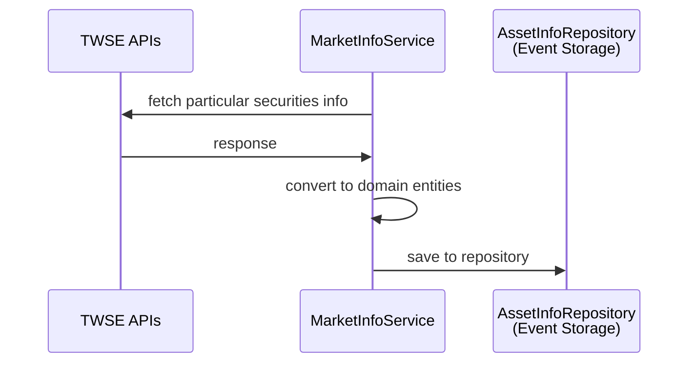

# Experiment Feeder Python

## Description
This is a Python implementation of the `Feeder` in the ***Experiment*** project.
Please visit the documentation repository for more information: [**experiment-document**](https://github.com/maxswu/experiment-document).

## Key Features
- The source code is structured in a simple BDD (Behavior Driven Development) pattern, providing flexibility for testing and refactoring while remaining easy to read.
- Use the popular [Pydantic](https://docs.pydantic.dev/) library for reliable data validation.
- Utilizes the lightweight scheduling framework [APScheduler](https://github.com/agronholm/apscheduler) for task scheduling without relying on specific operating systems or container engines.
- Implements a simple producer from [confluent-kafka-python](https://github.com/confluentinc/confluent-kafka-python) to keep the code straightforward, aligning with the `Feeder`’s role.

## Installation
```commandline
poetry install
```

## Usage

> Ensure you have a properly configured `.env` file or have exported the necessary environment variables.
> See [`.env.sample`](.env.sample) for more information.

### Start the app

```commandline
python -m app
```

or

```commandline
docker compose up
```

### Dry run (without producing events to storage)
```commandline
python -m app --dry
```

## Code Structure
```text
.
├── app  # Application
│   ├── __main__.py
│   ├── config.py
│   └── job.py
├── domain  # Domain use cases and interfaces
│   └── market_info
│       ├── model
│       │   ├── common.py
│       │   └── twse.py
│       ├── repository
│       │   └── asset_info.py
│       ├── service
│       │   └── twse.py
│       └── use_case.py
├── infra  # Implementations
│   ├── config.py
│   └── market_info
│       ├── repository
│       │   └── asset_info.py
│       └── service
│           ├── config.py
│           └── twse.py
└── tests  # Tests
    └── domain
        └── test_use_case.py
```

## Use Cases

### 1. Get TWSE securities information


## TODOs
- [ ] Add more tests.
- [ ] Fix health check.
- [ ] CI / CD.
- [ ] Integration with the Shared Cache Service.